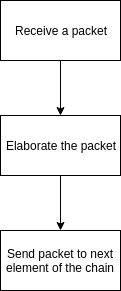
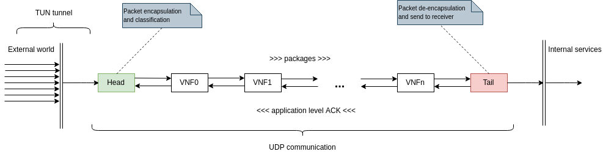

# Astaire

The communication among VNFs is implemented using UDP protocol and in order to do so we developed [astaire](https://github.com/Augugrumi/astaire). Astaire is basically a software that works both as UDP server and UDP client. 

In that new version of our implementation each VNF has the capability of receiving UDP packets and sends them to the next element of the chain. In order to make everything works 2 elements at the 2 ends of the chain are needed: the head of the has the aim to receive packets from a TUN tunnel, contact the classifier in order to define the chain and then to send the original packet, wrapped into a UDP packet, to the first "real" VNF. The _tail,_ likewise, has to unwrap the packet modified by the chain of VNF, sending it to the original receiver.

### Deploy

In order to deploy that system we developed a container for the VNF: this allows us to deploy it even on Kubernetes.

