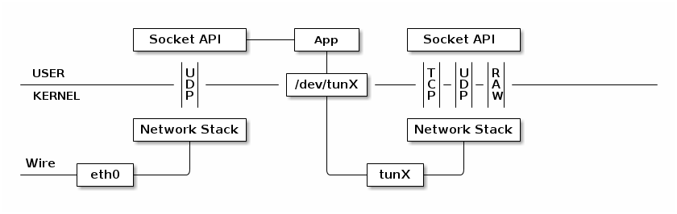

# How to communicate with the NFVI

Communications with the NFVI are not trivial: there are different problematics that range from the initial connection to the way packets have to be transmitted. Here, during our thesis development, we come up with two approaches at these problems: using a tunnel \(TUN/TAP section\) to automatically encapsulating the data \(at the cost of losing the NFVI transparency\) or using a proxy to make the NFVI like a man-in-the-middle, handling the extremes of the communications with the sender and the receiver.

## TUN/TAP

TUN and TAP are virtual kernel interfaces. These differs from the normal network interfaces because they are completely software and no physical components are required. 

TUN \(network TUNnel\) operates with layer-3 packets \(as IP packets\), TAP instead \(network tap\) works on layer 2, with Ethernet packets. When used with user-space programs TUN/TAP devices injects packets to the operating-system network stack: this emulates incoming data from an external source. 

In order to manage the communications on a tun/tap interface the program gets a file descriptor where its able to perform I/O operations. From the kernel point of view these packets are behave the same as incoming packets from an external source.

These interfaces can be both **transient** and **persistent**. Transient means that the interface is created, used and destroyed by the same program, persistent means that are used some utility to create them and then programs can attach to it.

Once created the interfaces can be used as normal "hardware" network interfaces. 

TUN e TAP interfaces are used for VPNs, virtual machine networking, to connect physical machines to network emulators and NATs. 



### Network tunnel

Network tunneling protocol is a communication protocol that makes possible exchange of data in secure ways across public networks and to run a protocol that is not supported by a certain network thanks to the encapsulation. Basically, the tunneling protocol works wrapping the original packet inside the payload of a new one.

### Network TAP

Network Terminal Access Point is a external monitoring device that mirrors the traffic that pass through two nodes, instead TAP is the device in the network that actually monitor the traffic. 

### TunConnector

The first change we performed was to create a TUN tunnel between VNFs. This allowed us to manipulate packages in better way encapsulating the original message sent from the sender as the payload of a UDP packet, and exchanging it among the VNFs. In that way we were able to maintain most of the original information, and to send the packet to the right destination.

In order to accomplish that, we create [TunConnector](https://github.com/Augugrumi/TunConnector): this is a naive implementation of a software that create a virtual tun interface on the host machine and than allows the connection to another machine or waits for connection. This software was developed following this [tutorial](https://backreference.org/2010/03/26/tuntap-interface-tutorial/) and starting from [simpletun](https://github.com/gregnietsky/simpletun) code.

TunConnector requires to specify the port on the host used to create the TUN tunnel and the IP that will be used in it to reach the machine.

#### Ho

#### w it works

TunConnector can work as a client, server or both modality \(for a certain link the host will be a client, for another the server\). The first operation that it performs in each configuration is to create a TUN device using an [OpenVPN](https://openvpn.net/) utility:

```bash
# openvpn --mktun --dev tun3
# ip link set tun3 up
# ip addr add 192.168.0.2/24 dev tun3
```

In order to perform that operation TunConnector must run as root. First command create an interface, in this case called `tun3`. The second one turns up the newly created interface. Last one set the IP address \(in the example above 192.168.0.2\) that will be used in the tunnel. This is a naive way to create a persistent interface: in fact it is possible to do it using C++, but for the sake of simplicity and because of the controlled environment in which we work, that is the best choice.

After both in client and in server mode it allocates 2 socket, retrieving the correspondent file descriptors: one is used for the communication inside the tunnel, the other to communicate with the "usual" network. In case of server mode after it binds a socket to a specific port in order to listen for requests of connections. 

Once a server receive a request of connection from a certain client, the tunnel will be created. This tunnel consist of a infinite loop in which data for the tunnel are redirected to the right file descriptor from the network and vice versa.

#### Example

Usage:

```bash
$ sudo ./TunConnector [OPTIONS]
```

* `--serverinterface -p X` To set the name if the interface used by the server component
* `--clientinterface -n X` To set the name if the interface used by the client component
* `--serverip -s X` To set the IP on the server interface
* `--clientip -c X` To set the IP on the client interface
* `--inport -i X` To set the port used by the server component. Default `55556`
* `--remoteip -r X` To set the ip of the remote server to connect to
* `--mode -m [client|server|both]` To set run mode. Default `both`
* `--help -h` Show the help


with the following options



`$ sudo ./TunConnector -p tun0 -s 10.0.0.2 -i 55555 -m server`



`$ sudo ./TunConnector -n tun0 -c 10.0.0.3 -o 55555 -i 192.168.6.9 -m client`



In the example above we suppose to create a server on a host with IP `192.168.6.9` \(the IP is required from the client\), that accept requests on port `55555`. The interface will be named tun0 and inside the tunnel the machine will have the address `10.0.0.2`.

In an another machine the client run in a mirrored way the program, specifying the server port and IP address.

Once the tunnel is up, you can check that the connection is working for example pinging the two ends of the tunnel with the IP address used inside the tunnel.  

#### Problems of this approach

At the end of the day we've choose to not use this approach, because the use of point-to-point connections made our entire structure stiff: our final goal is to have VNF chains that can dynamically adapt and change. Making point-to-point connections means this it's not possible, because every time a packet has to go to a new VNF first a new connection \(tunnel\) has to be established and next the packet has to be sent. This, multiplied for a great number of packets makes the whole system unsustainable. Finally, scalability has to be taken in consideration too: when creating a point-to-point connection between two pods these jeopardize a fair load distribution between replicas, since the tunnel is created only with one instance, and not all of them. Thus, to make the system really scalable, every connection should be service-to-service, and not point-to-point, making the total number of the connections between two VNF services equal to N \* M, where N is the number of pods for one VNF service and M is for the other one.

This is why we opted for a proxy-oriented solution.

## Proxy connection


