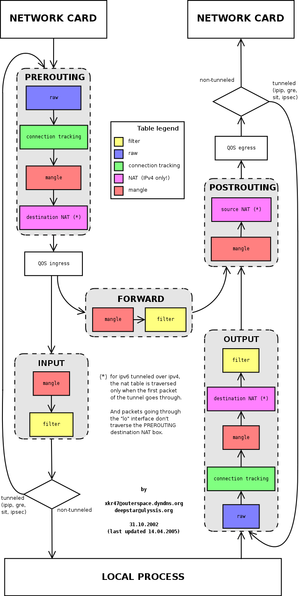

# Floodlight and docker

## Prerequisites

First of all, you need an AWS account to be able to follow these steps. You can create a new one, and we'll use the free tier, so we won't waste money.

This page tells you how to set up floodlight with docker.

### Components to install

You have to install these components on your PC \(we assume you use Linux, otherwise you'll be on your own\):

* Vagrant
* AWS plugin for Vagrant \([https://github.com/mitchellh/vagrant-aws](https://github.com/mitchellh/vagrant-aws)\)
* SSH

### Grabbing AWS credentials

We assume you're proficient with AWS, so as you know when you use AWS API you need an access token and a secret key. Grab one from your IAM console, and be sure it can manage EC2 instances \(in particular, be sure `create` and `destroy` permissions are given\)

## Getting your hand dirty

After the initial configuration, it's time to messing around!

### Boring stuff

After you've set up successfully your machine, we're ready to start. Go on your AWS console and create an EC2 micro instance, then delete it. This will also create a key pair \(keep it!\) and automatically set up a default security group, that we're gonna use.

Now clone the `vagrantfiles` repository`:`

```bash
$ git clone https://github.com/Augugrumi/vagrantfiles.git
```


If you want to use the same version the author is using at the moment of writing this guide, check out to this SHA: `de3f6a31c31b2b888fa2a9961fcf26eeb566d56d`. Simply open a terminal and type:

```bash
cd vagrantfiles; git checkout de3f6a31c31b2b888fa2a9961fcf26eeb566d56d
```


Move inside the repository, then `cd` into ovs-vagrant folder and finally type:

```bash
export ACCESS_KEY_ID="your aws access key id"
export SECRET_ACCESS_KEY="your secret key"
export SSH_KEY_PATH="path/to/the/.pam/file"
vagrant up
# Wait for the machine to go up...
# ...and if the command completes successfully
vagrant ssh
# You should now ssh'ed in the VM
```

Once you've copy-pasted all this boring stuff, you should have a working sandbox. You can see the machine comes with a floodlight image already downloaded.

### Fun stuff

The box has a special command, called `netboot`, that automatically:

* creates an ovs bridge
* builds and runs a couple of `nginx` containers without any network controller
* adds a new network interface
* sets iptables \(we'll talk about it below\)
* adds the containers in the new network interface
* pings the two containers three times

Try it! You'll feel like an hacker, without the hassle to type things on the keyboard. But what just happened? Below we're gonna explain the most important steps of this script.

#### Going down the rabbit hole: iptables configuration

Iptables is a ugly beast, and here I'll try to explain what the rules do, since routing is particular important. To help explaining what's happening with the packets flow, keep in mind this image 



The rules that `netboot` applies, are:

```bash
export pubintf=eth0
export privateintf=ovs-br1
sudo iptables -t nat -A POSTROUTING -o $pubintf -j MASQUERADE
sudo iptables -A FORWARD -i $privateintf -j ACCEPT
sudo iptables -A FORWARD -i $privateintf -o $pubintf -m state --state RELATED,ESTABLISHED -j ACCEPT
```

The first iptables command messes with the `nat` table, that, copying from the [man page](http://ipset.netfilter.org/iptables.man.html) is:

> This table is consulted when a packet that creates a new connection is encountered. It consists of three built-ins: **PREROUTING** \(for altering packets as soon as they come in\), **OUTPUT** \(for altering locally-generated packets before routing\), and **POSTROUTING** \(for altering packets as they are about to go out\).

So, we are altering packets that are about to go out from the`ovs-br1` interface \(that's what the `-o` flag means\), and we send them into the MASQUERADE chain, that is \(copying again from the [man page](http://ipset.netfilter.org/iptables-extensions.man.html)\):

> This target is only valid in the **nat** table, in the **POSTROUTING** chain. It should only be used with dynamically assigned IP \(dialup\) connections: if you have a static IP address, you should use the SNAT target. Masquerading is equivalent to specifying a mapping to the IP address of the interface the packet is going out, but also has the effect that connections are forgotten when the interface goes down. This is the correct behavior when the next dialup is unlikely to have the same interface address \(and hence any established connections are lost anyway\).

Basically, we use MASQUERADE to "fake the outgoing packet" going out from `ovs-br1`, making them seems like they comes from our host. A better phrasing can be found from [libalias](https://gsp.com/cgi-bin/man.cgi?section=3&topic=libalias):

> Outgoing packets from a local network with unregistered IP addresses can be aliased to appear as if they came from an accessible IP address.

The next iptables command appends \(`-A` flag\) in the FORWARD chain a rule stating that all the packets coming from `ovs-br1` have to go to the ACCEPT chain. The ACCEPT chain lets the packages pass trough the firewall. Copying again from the [man page](http://ipset.netfilter.org/iptables.man.html), these are the firewall chains:

> **ACCEPT** means to let the packet through. **DROP** means to drop the packet on the floor. **QUEUE** means to pass the packet to userspace. \(How the packet can be received by a userspace process differs by the particular queue handler. 2.4.x and 2.6.x kernels up to 2.6.13 include the **ip\_queue** queue handler. Kernels 2.6.14 and later additionally include the **nfnetlink\_queue** queue handler. Packets with a target of QUEUE will be sent to queue number '0' in this case. Please also see the **NFQUEUE** target as described later in this man page.\) **RETURN** means stop traversing this chain and resume at the next rule in the previous \(calling\) chain. If the end of a built-in chain is reached or a rule in a built-in chain with target **RETURN** is matched, the target specified by the chain policy determines the fate of the packet.

The last rule \(the most important we dare to say\) allows the packets coming from the local network we've created \(`ovs-br1`\) to the external one. In particular, it forwards only the packets that matches the state ESTABLISHED and RELATED. The _state_ is an iptables extension, able to recognize the type of packages passing through the firewall. We're gonna copy-paste, again from the iptables [man page](http://ipset.netfilter.org/iptables-extensions.man.html), the explanation of these states:

> **INVALID:** The packet is associated with no known connection.  
> **NEW:** The packet has started a new connection, or otherwise associated with a connection which has not seen packets in both directions.  
> **ESTABLISHED:** The packet is associated with a connection which has seen packets in both directions.  
> **RELATED:** The packet is starting a new connection, but is associated with an existing connection, such as an FTP data transfer, or an ICMP error.  
> **UNTRACKED:** The packet is not tracked at all, which happens if you explicitly untrack it by using -j CT --notrack in the raw table.  
> **SNAT:** A virtual state, matching if the original source address differs from the reply destination.  
> **DNAT:** A virtual state, matching if the original destination differs from the reply source.

Wrapping this long explanation up, we set up iptables to alias the packages coming from our local network interface \(`ovs-br1`\) and directed to go outside it, as they were created directly from the host. Why have we done this? Because we're gonna attach floodlight next.

#### Attaching floodlight \(ovs controller\) to our local network

Now that our network is set up, and our containers can talk between each other and with the rest of the world, we can attach our ovs controller. Launch it with:

```bash
docker run -d -p 6653 -p 80:8080 --name=floodlight pierrecdn/floodlight
```

This will launch floodlight, and the UI will be accessible from the port 80. Floodlight, with the vanilla configuration, won't discover any node in the network until they start sending packages. By the way, we haven't instructed ovs that there is a new controller in town, so we have to set it with this command:

```bash
sudo ovs-vsctl set-controller ovs-br1 tcp:172.17.0.2:6653
```

`172.17.0.2` is not a random IP address, but that's the floodlight internal IP. You can retrieve yours typing:

```bash
docker inspect floodlight | grep IPAddress
```

At this point, ovs knows there is a controller to ask for routing packets, and floodlight is ready to accept incoming packages and instruct the switch accordingly. Actually, since we haven't configured floodlight yet, it won't do anything in particular, apart discovering new nodes when they sends packets. With the floodlight console opened, you can see this happening typing in the VM console:

```bash
docker exec container1 ping -c 10 192.168.1.2
```

Here `container1` will ping `container2` ten times. While this is happening, the two containers will talk to each other exchanges packages, that they will first go through the iptables rules and then they will pass through the floodlight controller, that finally it will see two new nodes in the network and it will register them, updating the UI. At the end, you'll be able to see the UI refreshing with two new members in the list.

Yay! That's all, for now.

