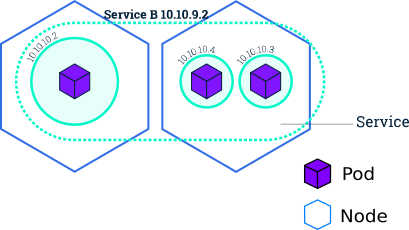
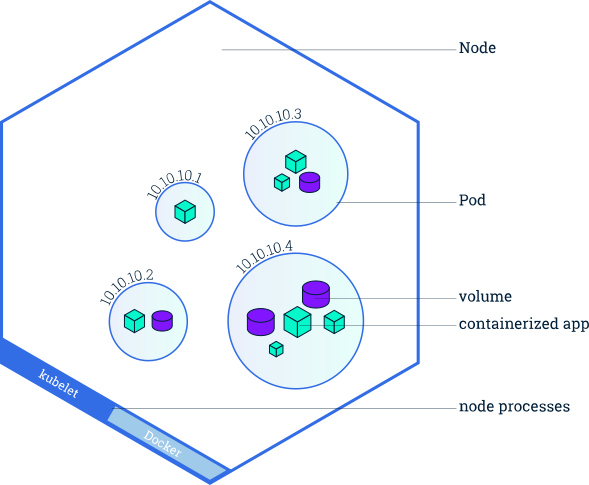
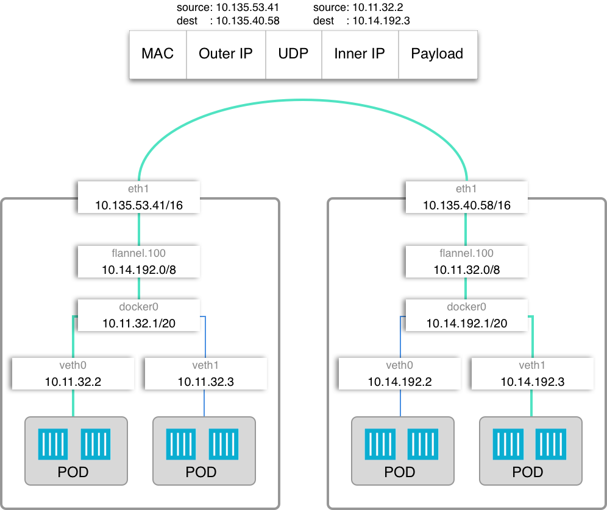
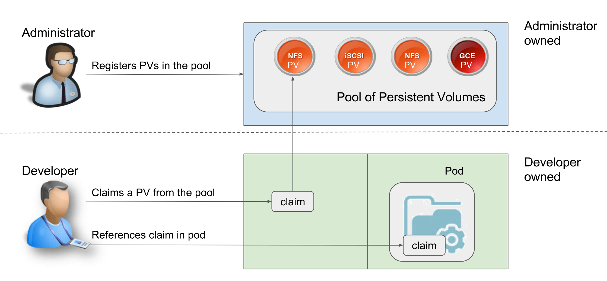

# Kubernetes

## Kubernetes for dummies

Before starting messing up with Kubernetes you need to know few, but important, concepts about it. Since Kubernetes has a lot of functionalities it could be difficult to get them all at the fist time. Since we're simple Kuberentes user we don't want to race with the official documentation, thus, if you don't understand some concepts, we suggest you to study from here.

In this section you'll find a summary of the basic concepts of Kubernetes that can be useful to read in case you need to refresh your memory.

### Kubernetes basic concepts

#### Pod

A pod the most basic building block for Kubernetes. A pod usually contains one or more container \(if the containers are higly coupled\), but Kubernetes it's able to manage different virtualization technologies \(e.g. [Virtual Machines](https://github.com/kubevirt/kubevirt)\). Pods have a life cycle, where it can assume these states \([stealing the table directly from the official docs](https://kubernetes.io/docs/concepts/workloads/pods/pod-lifecycle/)\):

* **Pending**: The Pod has been accepted by the Kubernetes system, but one or more of the Container images has not been created. This includes time before being scheduled as well as time spent downloading images over the network, which could take a while.
* **Running**: The Pod has been bound to a node, and all of the Containers have been created. At least one Container is still running, or is in the process of starting or restarting.
* **Succeeded**: All Containers in the Pod have terminated in success, and will not be restarted.
* **Failed**: All Containers in the Pod have terminated, and at least one Container has terminated in failure. That is, the Container either exited with non-zero status or was terminated by the system.
* **Unknown**: For some reason the state of the Pod could not be obtained, typically due to an error in communicating with the host of the Pod.

A pod can have different conditions too:

* **PodScheduled**: the Pod has been scheduled to a node;
* **Ready**: the Pod is able to serve requests and should be added to the load balancing pools of all matching Services;
* **Initialized**: all [init containers](https://kubernetes.io/docs/concepts/workloads/pods/init-containers) have started successfully;
* **Unschedulable**: the scheduler cannot schedule the Pod right now, for example due to lacking of resources or other constraints;
* **Unschedulable**: the scheduler cannot schedule the Pod right now, for example due to lacking of resources or other constraints;

#### Service

Since pods for their nature are highly volatile, applications that use them can not rely on their IP address. To solve this problem, the Service implementation in Kubernetes assure a stable IP, even if different pods in this service crash and gets restarted by a ReplicaSet \(witch will not be explain in this guide, but it basically scale up and down pods - [more info here](https://kubernetes.io/docs/concepts/workloads/controllers/replicaset/)\)

Citing the [official documentation](https://kubernetes.io/docs/concepts/services-networking/service/), the Service is:  
_A Kubernetes Service is an abstraction which defines a logical set of Pods and a policy by which to access them - sometimes called a micro-service._



#### Volume

When Pods saves data on a node, this data is destinated to perish. Kubernetes offers a way to save this data and to possibly make it available to all the pods replicas, offering a transparent layer where pods are not aware of working with data shared other pods, even located in other nodes. This functionality is called Volume, and there are many different drivers, that range from a simple local storage to glusterfs.

#### Namespace

Namespaces are intend to be used when there are multiple users using the cluster, or to separate multiple projects.

### Kubernetes architectural concepts

#### Node

A node is the building block for a Kubernetes cluster. Every must have at least the kubelet daemon \(to manage kubernetes functionalities\) and a container manager \(e.g. Docker, VirtualBox\) running. A node runs pods and can communicate with other nodes in the same cluster



#### Master

The master node is the one that starts a cluster, and that manage the slaves. In the master node only some pods can run in it \(e.g. the dashboard\).

The master generates the token for the slaves to join, and coordinates the federation with other clusters. In a cluster, there is the possibility to have multiple master to assure high availability.

#### Slave

A slave is a node that run the pods that the master schedule. It can also be part of a PersistentVolume storage \(like GlusterFS\) and if it goes down another slave will take care of the pods that where running on it. Slaves can join existing cluster via a given token.

#### Networking

Kubernetes, even if it uses Docker as a matter of fact for running containers, it has its networking structure. In particular, it delegates the network operations \(like packet forwarding\) to different managers, like for example Flannel or Calico.

Every nodes in the cluster runs a pod called `kubeproxy`, that communicates with the `kube-api` pod \(running in the master\) and the `kube-dns` \(for Kubernetes &lt;=1.9.x\) or `CoreDNS` \(for Kubernetes &gt;=1.10.x\). kubeproxy assure transparent communication between pods in the same cluster, and kube-api allows to call Kubernetes services. kube-dns/CoreDNS manage DNS request coming from the pods, differencianting the one that goes outside the cluster from the other that point internally.



Additional information about Flannel, Kubernetes and Docker networking can be found here:

[https://www.sdxcentral.com/cloud/containers/definitions/what-is-coreos-flannel-definition/](https://www.sdxcentral.com/cloud/containers/definitions/what-is-coreos-flannel-definition/)

### Focusing on Storage

This section is based on official Kubernetes documentation on [persistent volumes](https://kubernetes.io/docs/concepts/storage/persistent-volumes/) and [from this site](https://thenewstack.io/strategies-running-stateful-applications-kubernetes-persistent-volumes-claims/).

#### Volumes, Claims and Classes

Managing compute and storage are totally different problems and in order to abstract the last one Kubernetes relies on **PersistantVolume** and **PersistantVolumeClaim** resources.

A PersistantVolume \(**PV**\) is something similar to a  node, in fact is a piece of storage provided by the administrator: it captures the details of the implementation of the storage and has a lifecycle that is independent of any individual pod. To not expose developers to storage boring details admins can expose different PV types through **StorageClasses**.

A PersistantVolumeClaim \(**PVC**\) instead is a request for storage and it is similar a pod: instead of requesting memory and CPU, a PVC requests certain size and access mode to storage.



It is important to understand the difference on **Volumes** and **PersistantVolumes**. ****The former is something like Docker volumes, used for persistence, host-based or on external block storage devices but a user doesn't expect resources be reserved before using volumes. In persistent volumes and claims, there is a strict enforcement of resource utilization dictated by the policy defined during the creation of resources. Kubernetes pod can use claims as volumes.

**StorageClasses** are a way to describe different type of storage that can be used. Different classes can be used to describe different levels of service or policies. PVCs that don't specify a paticular class can use the default one: to define it you can use annotation `"storageclass.kubernetes.io/is-default-class":"true"`, as for instance:

```bash
kubectl patch storageclass glusterfs-storage -p '{"metadata": {"annotations":{"storageclass.kubernetes.io/is-default-class":"true"}}}'
```

  
For more information on different provisioners, policies and parameters see this [link](https://kubernetes.io/docs/concepts/storage/storage-classes/).


#### Lifecycle

1. **Provisioning**: there are 2 ways: statically or dynamically. _Static_ means that an administrator creates some PVs that are available for consumption. _Dynamic_ means that the cluster dynamically try to provide a volume that matches a PVC. This is done with _StorageClasses_: a claim requests storage for a certain storage class that can be provisioned. The class `""`  disable dynamic provisioning.
2. **Binding**: a user requests a certain amount of storage with a claim and a control loop in the master look for a PV that can bind the claim. In case of dynamic provisioning the loop always bind a PVC to a PV, otherwise user will always get at least what they asked for, but the volume may be larger. Claims can remain unbound if a matching volume does not exists. 
3. **Using**: after the binding phase the pod start using the volume \(PVC is described in the pod yaml, [at this link the syntax](https://kubernetes.io/docs/concepts/storage/persistent-volumes/#claims-as-volumes)\)'
4. **Releasing**: when an application is done with using the volume, developers can delete the PVC objects through the API, releasing the claim. This step will initiate the reclamation process.
5. **Reclaiming**: this phase is defined as a policy by the administrators. The reclaim policy for a PersistentVolume tells the cluster what to do with the volume after it has been released of its claim. Persistent volumes can either be _retained_, _recycled_ or _deleted_. 

## Installing Kubernetes

We performed our Kubernetes installation in a Openstack environment. Since we used the Openstack of our school department, the administrator have given us a virtual machine, Openstack-CLI, to perform cli operations. From now, our scripts assume you're in a machine with access to openstack, and that you have sourced your openrc.sh script before continuing.

We performed our first installation with Ubuntu, but since it was not fully successful, we changed distro with CentOS. In this tab you can find the two versions.





### Installing Kubernetes on CentOS

To install Kubernetes on CentOS 7 we develop a script available [on this page](https://github.com/Augugrumi/init-script/tree/centos/kubernetes). With CentOS is possible to have a complete installation with a GlusterFS-PersistentStorage correctly set.

After there is an explanation for the most important part of the scripts. The script [on\_openstack\_cli.sh](https://github.com/Augugrumi/init-script/raw/centos/kubernetes/on_openstack_cli.sh) main aim is to run other file retrieving information using even `nova` commands.

First is needed to install all the software needed an for this the script [install\_kubectl\_repo.sh](https://raw.githubusercontent.com/Augugrumi/init-script/centos/kubernetes/install_kubectl_repo.sh) was created. This only call another script and wait until all machine are ready. The other script is [bootstrap.sh](https://raw.githubusercontent.com/Augugrumi/vagrantfiles/oldversion/kubernetes/centos/bootstrap.sh) whose aim is to configure the machine and the install  the necessary software.   
Boostrap script first **disable SELinux** on all machines \(needed for Kubernetes networking\)

```bash
sudo setenforce 0
sudo sed -i --follow-symlinks 's/SELINUX=enforcing/SELINUX=disabled/g' /etc/sysconfig/selinux
```

then **enable br\_netfilter** module \(needed for Kubernetes networking\)

```bash
sudo modprobe br_netfilter
sudo sh -c 'echo "1" > /proc/sys/net/bridge/bridge-nf-call-iptables'
```

**Switch off the swap** by the commands

```bash
sudo swapoff -a
sudo sed -i '/swap/d' /etc/fstab
```

And finally add `rbd`, `ip_vs`, `ip_vs_rr`, `ip_vs_wrr`, `ip_vs_sh`, `dm_snapshot`, `dm_mirror` and `dm_thin_pool` to modules that will be loaded to machine startup.

```text
sudo sh -c 'echo -e "rbd\nip_vs\nip_vs_rr\nip_vs_wrr\nip_vs_sh" >  /etc/modules-load.d/ip_vs.conf'
sudo sh -c 'echo -e "dm_snapshot\ndm_mirror\ndm_thin_pool" >  /etc/modules-load.d/gluster.conf'
```

Note: Last 3 modules will be useful in the case that you want to install GlusterFS on your machines.

In the end the script install `docker`, `device-mapper-persistent-data`, `lvm2`, `kubelet`, `kubectl` and `kubeadm` and start \(and enable\) `docker` and `kubelet` services.

After rebooting all the machine, the installation go on adding in the `/etc/hosts` file of all node that will be part of the Kubernetes cluster the IP and the name of all the nodes.

After the installation continues in the **master** node, with the [script on\_master.sh](https://raw.githubusercontent.com/Augugrumi/init-script/centos/kubernetes/on_master.sh). We run `kubeadm` by the command

```bash
sudo kubeadm init --apiserver-advertise-address=<ip-of-the-master> --pod-network-cidr=10.244.0.0/16 --ignore-preflight-errors cri | grep "kubeadm join" > /home/centos/joincommand
```

Saving part of the output that will be necessary for other nodes to join the cluster.  
Note 1:`--pod-network-cidr` depends on which agent you want to use to configure Kubernetes network. We choose Flannel se we put `10.244.0.0/16`.  
Note 2: we don't know at the moment why some preflight errors was launched by the command and in order to do so \(since everything seems working\) we added `--ignore-preflight-errors cri` to go on.  
This save in the `joincommand` file the command to be run on slave node to join the cluster.  
  
And after give the following commands to create the folder needed by Kubernetes

```bash
mkdir -p $HOME/.kube
sudo cp -i /etc/kubernetes/admin.conf $HOME/.kube/config
sudo chown $(id -u):$(id -g) $HOME/.kube/config
```

Then wait for all pods that are ready \(`kubectl get pods --all-namespaces`\).

Following, install [Flannel](https://github.com/coreos/flannel) for the networking and wait that it is up.

```bash
kubectl apply -f https://raw.githubusercontent.com/coreos/flannel/master/Documentation/kube-flannel.yml
kubectl apply -f https://raw.githubusercontent.com/coreos/flannel/master/Documentation/k8s-manifests/kube-flannel-rbac.yml
```

And then it is possible to setup the dashboard to access K8s resources

```bash
kubectl create serviceaccount dashboard -n default
  kubectl create clusterrolebinding dashboard-admin -n default \
   --clusterrole=cluster-admin \
   --serviceaccount=default:dashboard
  kubectl get secret $(kubectl get serviceaccount dashboard -o jsonpath="{.secrets[0].name}") -o jsonpath="{.data.token}" | base64 --decode >  secret.txt
  screen -dmS kubectl_proxy_screen bash
  screen -S kubectl_proxy_screen -X stuff "kubectl proxy
  "
```

With this command we make the dashboad accessible on port 8001 of the master node at this URL `https://<master-ip>:<apiserver-port>/api/v1/namespaces/kube-system/services/https:kubernetes-dashboard:/proxy/`

The previous command also the token to access the dashboard on `secret.txt` file on the home folder of the master node. 

The last thing to do is to make other node join the cluster, using the `joincommand` file that we created before.  
   


We haven't made up nothing, but we've googled a lot before coming to this solution. Here are our sources:

{% embed data="{\"url\":\"https://www.howtoforge.com/tutorial/centos-kubernetes-docker-cluster/\",\"type\":\"link\",\"title\":\"How to Install a Kubernetes Docker Cluster on CentOS 7\",\"description\":\"In this tutorial, I will show you step-by-step how to install and configure Kubernetes and Docker on CentOS 7. Kubernetes is an open source platform f...\",\"icon\":{\"type\":\"icon\",\"url\":\"https://www.howtoforge.com/favicon.ico\",\"aspectRatio\":0},\"thumbnail\":{\"type\":\"thumbnail\",\"url\":\"https://www.howtoforge.com/images/teaser/centos.gif\",\"width\":42,\"height\":40,\"aspectRatio\":0.9523809523809523}}" %}

{% embed data="{\"url\":\"https://github.com/kubernetes/kubernetes/issues/60869\",\"type\":\"link\",\"title\":\"kube-proxy can\'t load xz compressed kernel ip\_vs module · Issue \#60869 · kubernetes/kubernetes\",\"description\":\"Is this a BUG REPORT or FEATURE REQUEST?: /kind bug What happened: kube-proxy failed to load ip\_vs.ko.xz module What you expected to happen: compressed kernel module ip\_vs could loaded by kube-prox...\",\"icon\":{\"type\":\"icon\",\"url\":\"https://github.com/fluidicon.png\",\"aspectRatio\":0},\"thumbnail\":{\"type\":\"thumbnail\",\"url\":\"https://avatars1.githubusercontent.com/u/714445?s=400&v=4\",\"width\":400,\"height\":400,\"aspectRatio\":1}}" %}



### Installing Kubernetes on Ubuntu 16.04 \(Xenial Xerus\)

We first tried to install Kubernetes on Ubuntu, is the distro we're more familiar with. To install Kubernetes on Ubuntu 16.04 Xenial Xerus we develop a script available [on this page](https://github.com/Augugrumi/init-script/tree/master/kubernetes).  Please note the this is not a complete installation! We were not able to get GlusterFS working with Ubuntu, thus we changed distro with CentOS.



## Persistent Storage

### Prerequisites

* A working installation of Kubernetes
* Python \(2.7\) installed and available on all Kubernetes nodes

### GlusterFS




#### GlusterFS on CentOS 7

To enable persistent storage in Kubernetes with Glusterfs you need at least three nodes. As we've already written above, we deployed our Kubernetes cluster using CentOS 7.  
Note: this procedure was tested on `Kubernetes v1.11.1.`

Since we're running our cluster on a Openstack environment, we attached one volume per VM. If you're in our shoes, just create some empty volumes and attach them to nodes you want to configure with glusterfs.

First of all, you need to install `gluster-server` on all the nodes that will join the storage and `gluster-fuse` to provide `mount.glusterfs` as an option to mount Gluster file systems. Open a terminal and type:

```bash
sudo yum install -y centos-release-gluster && \
sudo yum install -y glusterfs-server glusterfs-fuse
```

Our next step is to load different kenel modules, using `modprobe`:

```bash
sudo sh -c 'modprobe dm_snapshot && modprobe dm_mirror && modprobe dm_thin_pool'
```

To make this change permanent, create a new file in `/etc/modules-load.d/gluster.conf` with the following content:



```text
dm_snapshot
dm_mirror
dm_thin_pool
```



At this point, enable the `glusterd` daemon to start at every system start:

```bash
sudo systemctl start glusterd && sudo systemctl enable glusterd
```

For all the nodes you installed glusterfs you need to apply a particular label in you Kubernetes cluster. In a terminal, type:

```bash
kubectl label node <node name> storagenode=glusterfs
```

[According the gluster-kubernetes setup guide](https://github.com/gluster/gluster-kubernetes/blob/master/docs/setup-guide.md), you should also check that the following ports are reachable:

* 2222
* 24007
* 24008
* 49152-49251

On top of that, you'll need to grant access to your root account while installing all the stuff we need. In CentOS, if like us you're using the CloudImg image, you need to access every machine and type:

```bash
sudo su # gain superpowers
cd /root/
nano .ssh/authorized_keys
# edit the first line in the follwing way: from the sub-string starting
# as "ssh-rsa" untill the end put the content in a new line, while comment
# the whole line
nano /etc/ssh/sshd_config # un-comment "PermitRootLogin: yes"
systemctl restart sshd
```

At this point, you need to clone kubernetes-glusterfs, the repository that contains a magic script that will figure out all the necessary stuff \(e.g. heketi\), `gk-deploy`.

```bash
git clone https://github.com/gluster/gluster-kubernetes.git
cd gluster-kubernetes/deploy
```

We're reaching our goal, hold on! Now we need to define our topology. To do so, create a `tolopogy.json` from the sample \(`topology.json.sample`\) and edit to fit your necessities. Here, we report our:



```javascript

{
 "clusters": [
   {
     "nodes": [
       {
         "node": {
           "hostnames": {
             "manage": [
               "192.168.29.26"
             ],
             "storage": [
               "192.168.29.26"
             ]
           },
           "zone": 1
         },
         "devices": [
           "/dev/vdb"
         ]
       },
       {
         "node": {
           "hostnames": {
             "manage": [
               "192.168.29.19"
             ],
             "storage": [
               "192.168.29.19"
             ]
           },
           "zone": 1
         },
         "devices": [
           "/dev/vdb"
         ]
       },
       {
         "node": {
           "hostnames": {
             "manage": [
               "192.168.29.22"
             ],
             "storage": [
               "192.168.29.22"
             ]
           },
           "zone": 1
         },
         "devices": [
           "/dev/vdb"
         ]
       }
     ]
   }
 ]
}
```



As you can see, in "manage" we have put the IP address of our machine, even if we already defined their addresses in `/etc/hosts`. 

Ta-daan! 🎉 Now we're ready to deploy our Gluster cluster. From the master, type in a terminal the following command:

```bash
# assuming you still are in ~/blabla/gluster-kubernetes/deploy/
./gk-deploy -s <path/to/your/private/key> --ssh-user root --ssh-port 22 topology.json -y
```

At the end, if everything goes correctly, you should see a `StorageClass` template. Copy it deploy to your Kubernetes through `kubectl`.

```bash
kubectl create -f glusterstorageclass.yaml
```

Optionally, you can set it as default `StorageClass` with the following command:

```bash
kubectl patch -f glusterstorageclass.yaml \
-p'{"metadata": {"annotations":{"storageclass.kubernetes.io/is-default-class":"true"}}}'
```

Here you can additional sources:

{% embed data="{\"url\":\"https://askubuntu.com/questions/299676/how-to-install-3rd-party-module-so-that-it-is-loaded-on-boot\",\"type\":\"link\",\"title\":\"How to install 3rd party module so that it is loaded on boot?\",\"description\":\"I have a third party module to go with a frame grabber.  I\'ve downloaded the kernel source, followed the vendor\'s instructions to compile it, and have the resulting module, arvdrv.ko, sitting in a ...\",\"icon\":{\"type\":\"icon\",\"url\":\"https://cdn.sstatic.net/Sites/askubuntu/img/apple-touch-icon.png?v=e16e1315edd6\",\"aspectRatio\":0},\"thumbnail\":{\"type\":\"thumbnail\",\"url\":\"https://cdn.sstatic.net/Sites/askubuntu/img/apple-touch-icon@2.png?v=c492c9229955\",\"width\":316,\"height\":316,\"aspectRatio\":1}}" %}

{% embed data="{\"url\":\"https://www.youtube.com/watch?v=uaNZx2O9ihc\",\"type\":\"video\",\"title\":\"Provision Gluster Storage with REST API using Heketi\",\"description\":\"https://github.com/heketi/heketi\",\"icon\":{\"type\":\"icon\",\"url\":\"https://www.youtube.com/yts/img/favicon\_144-vfliLAfaB.png\",\"width\":144,\"height\":144,\"aspectRatio\":1},\"thumbnail\":{\"type\":\"thumbnail\",\"url\":\"https://i.ytimg.com/vi/uaNZx2O9ihc/maxresdefault.jpg\",\"width\":1280,\"height\":720,\"aspectRatio\":0.5625},\"embed\":{\"type\":\"player\",\"url\":\"https://www.youtube.com/embed/uaNZx2O9ihc?rel=0&showinfo=0\",\"html\":\"<div style=\\\"left: 0; width: 100%; height: 0; position: relative; padding-bottom: 56.2493%;\\\"><iframe src=\\\"https://www.youtube.com/embed/uaNZx2O9ihc?rel=0&amp;showinfo=0\\\" style=\\\"border: 0; top: 0; left: 0; width: 100%; height: 100%; position: absolute;\\\" allowfullscreen scrolling=\\\"no\\\"></iframe></div>\",\"aspectRatio\":1.7778}}" %}

{% embed data="{\"url\":\"https://blog.lwolf.org/post/how-i-deployed-glusterfs-cluster-to-kubernetes/\",\"type\":\"link\",\"title\":\"Two days of pain or how I deployed GlusterFS cluster to Kubernetes\",\"description\":\"I spent last two days installing GlusterFS storage on top of my Kubernetes. It took much more time and effort than it should. I faced all kinds of problems, some if which were not obvious and took a lot of googling. So I decided to write this post. Hopefully it will save some time for somebody. I was playing with helm. Trying to assemble a complex application with several dependencies from official chart repository.\"}" %}



#### GlusterFS on Ubuntu 16.04.4 LTS \(Xenial Xerus\)

We tried to install GlusterFS on Ubuntu 16.04.4 LTS but we failed. We followed the setup guide available [at this link](https://github.com/gluster/gluster-kubernetes/blob/master/docs/setup-guide.md) on Gluster [official repository](https://github.com/gluster). 

The first problem we encountered was the installation of all dependencies. In fact installing from apt-get the glusterfs-server glusterd wont start. Finally installing `glusterfs-server`,  `glusterfs-client` and `glusterfs-common` we solved this first issue. At the end `glusted` was available on all Kubernetes slave nodes.

We opened all other steps \(enabling ssh as root on all slave machine, that was not specified in the guide\) and we run the installation by the command:

```bash
./gk-deploy -s <path/to/your/private/key> --ssh-user root --ssh-port 22 topology.json -yv
```

As in the CentOS installation but the master node \(as we see in logs\) was not able to contact `glusterd` on nodes. We verified that all nodes were not on other gluster cluster, ports are not reachable and  ssh was not available but everything seemed to work. 

At the end, as we does not have any strict requisites on the OS to use, we decided to do not proceed down to this road.



## Ingress

{% embed data="{\"url\":\"https://blog.getambassador.io/kubernetes-ingress-nodeport-load-balancers-and-ingress-controllers-6e29f1c44f2d\",\"type\":\"link\",\"title\":\"Kubernetes Ingress 101: NodePort, Load Balancers, and Ingress Controllers\",\"description\":\"This article will introduce the three general strategies in Kubernetes for ingress, and the tradeoffs with each approach.\",\"icon\":{\"type\":\"icon\",\"url\":\"https://cdn-images-1.medium.com/fit/c/304/304/1\*5K3tnV4TXOeYzWWtI6giwQ.png\",\"width\":152,\"height\":152,\"aspectRatio\":1},\"thumbnail\":{\"type\":\"thumbnail\",\"url\":\"https://cdn-images-1.medium.com/max/2000/1\*N13z5Vqm2XMvvaHzhwIfpw.jpeg\",\"width\":2000,\"height\":1333,\"aspectRatio\":0.6665}}" %}

### Nginx

{% embed data="{\"url\":\"https://github.com/nginxinc/kubernetes-ingress/blob/master/docs/installation.md\",\"type\":\"link\",\"title\":\"nginxinc/kubernetes-ingress\",\"description\":\"kubernetes-ingress - NGINX and  NGINX Plus Ingress Controllers for Kubernetes\",\"icon\":{\"type\":\"icon\",\"url\":\"https://github.com/fluidicon.png\",\"aspectRatio\":0},\"thumbnail\":{\"type\":\"thumbnail\",\"url\":\"https://avatars0.githubusercontent.com/u/8629072?s=400&v=4\",\"width\":110,\"height\":110,\"aspectRatio\":1}}" %}

{% embed data="{\"url\":\"https://github.com/nginxinc/kubernetes-ingress/blob/master/docs/nginx-ingress-controllers.md\",\"type\":\"link\",\"title\":\"nginxinc/kubernetes-ingress\",\"description\":\"kubernetes-ingress - NGINX and  NGINX Plus Ingress Controllers for Kubernetes\",\"icon\":{\"type\":\"icon\",\"url\":\"https://github.com/fluidicon.png\",\"aspectRatio\":0},\"thumbnail\":{\"type\":\"thumbnail\",\"url\":\"https://avatars0.githubusercontent.com/u/8629072?s=400&v=4\",\"width\":110,\"height\":110,\"aspectRatio\":1}}" %}

### Ambassador



### Traefic



## Additional Tools

### Helm

To install Helm you need to be in the master node. Now install Helm according to the [official documentation](https://docs.helm.sh/using_helm/#installing-helm) \(and yes, we want to live to the edge piping scripts straight into bash\):

```bash
curl https://raw.githubusercontent.com/kubernetes/helm/master/scripts/get | bash
```

Now that we have Helm installed in our master node, let's define first some additional permission to get it work correctly. With your editor, create a new file \(we'll call it `helm.yaml` for sake of simplicity\):



```yaml
apiVersion: v1
kind: ServiceAccount
metadata:
  name: helm
  namespace: kube-system
---
apiVersion: rbac.authorization.k8s.io/v1beta1
kind: ClusterRoleBinding
metadata:
  name: helm
roleRef:
  apiGroup: rbac.authorization.k8s.io
  kind: ClusterRole
  name: cluster-admin
subjects:
  - kind: ServiceAccount
    name: helm
    namespace: kube-system

```



Move to the directory you've create the file, and from a terminal digit:

```bash
kubectl create -f helm.yaml
```

At this point, we have defined a new ClusterRole, _helm_, that has the possibility to interact with `kube-system` namespace. Now we're ready to deploy Tiller in our cluster \(Helm backend\). In your terminal type:

```bash
 helm init --service-account helm --wait
```

Now you should be able to use Helm! Enjoy [😏](https://apps.timwhitlock.info/emoji/tables/unicode#emoji-modal)

As always, our sources are:

{% embed data="{\"url\":\"https://github.com/kubernetes/helm/issues/2687\",\"type\":\"link\",\"title\":\"system:default not sufficient for helm, but works for kubectl · Issue \#2687 · kubernetes/helm\",\"description\":\"PROBLEM Helm reports lack of ACL&\#39;s as the reason that it can&\#39;t do list configmaps/pods/etc... However, the kubeconfig which it uses is valid. This is confusing b/c it mixes Tiller failures ...\",\"icon\":{\"type\":\"icon\",\"url\":\"https://github.com/fluidicon.png\",\"aspectRatio\":0},\"thumbnail\":{\"type\":\"thumbnail\",\"url\":\"https://avatars2.githubusercontent.com/u/826111?s=400&v=4\",\"width\":400,\"height\":400,\"aspectRatio\":1}}" %}

{% embed data="{\"url\":\"http://jayunit100.blogspot.com/2017/07/helm-on.html\",\"type\":\"link\",\"title\":\"Helm ON\",\"description\":\"Setting up helm on a secured kubernetes cluster.   Thanks to the heptio folks for helping me get this working by following up on https://git...\",\"icon\":{\"type\":\"icon\",\"url\":\"http://jayunit100.blogspot.com/favicon.ico\",\"aspectRatio\":0},\"thumbnail\":{\"type\":\"thumbnail\",\"url\":\"https://1.bp.blogspot.com/-zRLD0L7VbzE/WYOLeBt39oI/AAAAAAAAHQs/tnTWQKU-fZADMWJ2Ov1sxSpfbt8OuBKwACLcBGAs/w1200-h630-p-k-no-nu/Screen%2BShot%2B2017-08-03%2Bat%2B4.45.27%2BPM.png\",\"width\":868,\"height\":456,\"aspectRatio\":0.5253456221198156}}" %}

### Helm for lazy people

We developed a [script](https://raw.githubusercontent.com/Augugrumi/init-script/centos/helm/installer.sh) that automatically install Helm. To do so run on master node the command

```bash
bash <(curl -s https://raw.githubusercontent.com/Augugrumi/init-script/centos/helm/installer.sh)
```

