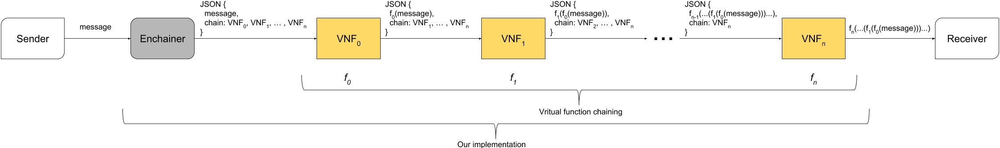
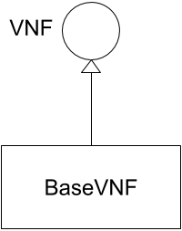
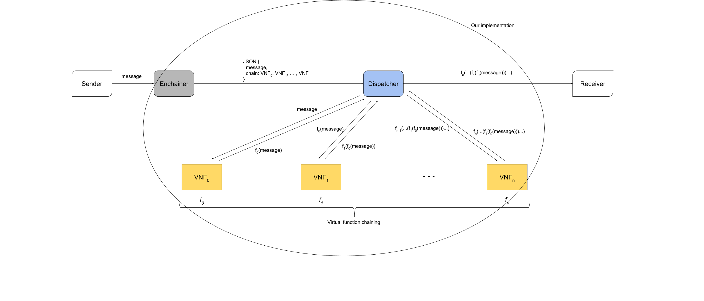

# VFC

The goal of our thesis is to create a chain of function that the message has to pass through to reach the destination, performing some changes to the original message to improve the performance of the overall network. This chain has to be deployed on Kubernetes, so it has to use container technology. At the moment, we present 2 different solutions, each of them has 2 different "kind" of deployment.

## First proposal



In our first implementation we propose to wrap up the original message as a field of a JSON message like:



```javascript
{
    "message":"<the-original-message>",
    "chain":["<chain>", "<of>", "<vnfs>", "<and>", "<destination>"]
}
```



This job is done by the component that we called `Enchainer`. This element \(the gray box in the figure above\) has 2 main tasks:

* Create the chain of the VNFs that have to modify the message. The choice can be delegated to another component, such as a classificator that, based on the typology of the message, create the best chain;
* Wrap the message received into a JSON with the 2 fields: `message` and `chain`. The message field is the original message, including the headers, as a string. The second is an array that contain the IP addresses of the VNFs, followed by the IP of the destination.

Each VNF \(yellow boxes in the figure above\) has to be a piece of code that must be able to receive a packet modify it and resend it. Following this solution each VNF has to be thought as a server that receive the message wrapped into the JSON, read it, applies the function that it has to apply and finally sends it to the next VNF. The last VNF of the chain has to forward the message modified from the chain to the "real" receiver.

In layman's terms, this idea is to add in the head of the chain a link that has to define the following links and each of them has a pre-defined operating template.

### Implementation

We implement this mechanism in Java and the code is available in [this repository](https://github.com/Augugrumi/chaining-functionalities). The `Enchainer` class is nothing more than a Java server implemented using [Netty](https://netty.io/). The choice of this framework is due to the possibility to easily serve both TCP and UDP connection. The code provides even the interface `VNF` and the abstract class `BaseVNF` that could be extended to implement the VNFs. In fact, implementing the method `String functionality(String message)` you can create your own VNF, without taking care about the overall functioning. The class BaseVNF use the [template method](https://sourcemaking.com/design_patterns/template_method) in order to receive messages, unwrap the message and the chain of VNFs, modify it and sending to the next hop \(deleting the actual link from the chain\). 



The communication among the VNFs was implemented using Rapidoid library, to persue the sake of semplicity.

The implementation of the VNFs is not bounded to Java. The only requirements are:

* to be able to receive a JSON message;
* to be able to modify the JSON, deleting the first element of the array;
* to be able to send the JSON message to the next element of the array.

### Deployment

Once the VNFs are created it is possible to create the chain and deploy it. Each both VNFs and enchainer must provide a Dockerfile to be deployed using docker. Examples of a VNF that only add a string to a message can be found in [this repository](https://github.com/Augugrumi/stringaddervnf-testvnf), instead the code for the main for the enchainer can be found in [this one](https://github.com/Augugrumi/enchainer-main).

#### Docker Compose

An example of deployment using Docker Compose can be found [there](https://github.com/Augugrumi/yaml-vnfs/tree/master/docker-compose/json-chain). This is out of the scope of our thesis, but we developed it for testing purposes.

#### Kubernetes

There are 2 approaches to deploy the chain on Kubernetes. Using a single pod or using multiple pod. In the first solution all functions have to run in the same machine, but it easier to deploy and probably message sending is quicker. The second typology is more scalable \(no requirements on the machine on which the VNF must run on\) and flexible. 

#### Kubernetes - Single pod deployment

An example of a single pod deployment can be found [there](https://github.com/Augugrumi/yaml-vnfs/tree/master/k8s/json-chain/unique-pod). In that YAML are defined a service that is exposed to make the enchainer reachable, a container for the enchainer and a container for each VNF. Generally speaking it is possible to deploy chains in that way using a single service to expose the enchainer and creating the chain of VNFs  as a multi-container pod.

#### Kubernetes - Multiple pods deployment

An example of a multi-pod deployment can be found [there](https://github.com/Augugrumi/yaml-vnfs/tree/master/k8s/json-chain/different-pods). In that YAML we defined a service and a deployment for each element of the solution \(both the enchainer and the VNFs\). Using this solution we expose all the links of the chain, so a single VNF can be used in more than one VFC. 

## Second proposal



As in the previous solution we have a component called `Enchainer` whose aim is to receive messages and wrap them into a JSON formatted as before. The differences with the first implementation concern how the messages are delivered among the VNFs. In this alternative solution we add a component, that we called `Dispatcher` \(the blue box in the picture above\), that works in the following manner: it receives the JSON wrapped message from the `Enchainer`, retrieve the value of the fields `message` and `chain`. After that it wrap up the message into another HTTP packet and sends it to the single VNFs progressively. Following that idea the VNFs has not to know nothing about the JSON formatting: they only to be pieces of code that accept a message on a certain port, modify the content of the message and sends it back.

In layman's terms, in the second solution we wanted to add a component that has the sake to manage forwarding of messages to the VNFs.

### Implementation

We implement this mechanism in Java and the code is available in [this repository](https://github.com/Augugrumi/chaining-functionalities). As before, `Enchainer` class is nothing more than a Java server implemented using [Netty](https://netty.io/). Even in that solution we implemented a hierarchy \(exactly as the previous one\) for VNF, but in this case the extending it is only for quickly create new VNFs. The last ones are implemented as be The `Dispatcher` class is basically a piece of code that use Rapidoid library to receive messages from the Enchainer and sends it to the VNFs.

As before, there are not requirements on the programming language to use to create VNFs. The only requirements are:

* To be able to receive messages;
* To be able to modify them;
* To be able to send the modified messages back, as reply.

### Deployment

The deployment works as in the previous solution, using Docker containers. Examples of a VNF that only add a string to a message can be found in [this repository](https://github.com/Augugrumi/stringaddervnf-testvnf), the code for the main for the enchainer can be found in [this one](https://github.com/Augugrumi/enchainer-main), and finally the main for the Dispatcher can be found [there](https://github.com/Augugrumi/alternative-dispatcher).

#### Docker Compose

An example of deployment using Docker Compose can be found [there](https://github.com/Augugrumi/yaml-vnfs/tree/master/docker-compose/alternative). This is out of the scope of our thesis, but we developed it for testing purposes.

#### Kubernetes - Single pod deployment

An example of a single pod deployment can be found [there](https://github.com/Augugrumi/yaml-vnfs/tree/master/k8s/json-chain/unique-pod). In that YAML are defined a service that is exposed to make the enchainer reachable, a container for the enchainer, one for the dispatcher and one for each VNF. Generally speaking it is possible to deploy chains in that way using a single service to expose the enchainer and creating the dispatcher and the chain of VNFs  as a multi-container pod.

#### Kubernetes - Multiple pods deployment

An example of a multi-pod deployment can be found [there](https://github.com/Augugrumi/yaml-vnfs/tree/master/k8s/json-chain/different-pods). In that YAML we defined a service and a deployment for each element of the solution \(enchainer, dispatccher and VNFs\). Using this solution we expose all the links of the chain, so a single VNF can be used in more than one VFC.

